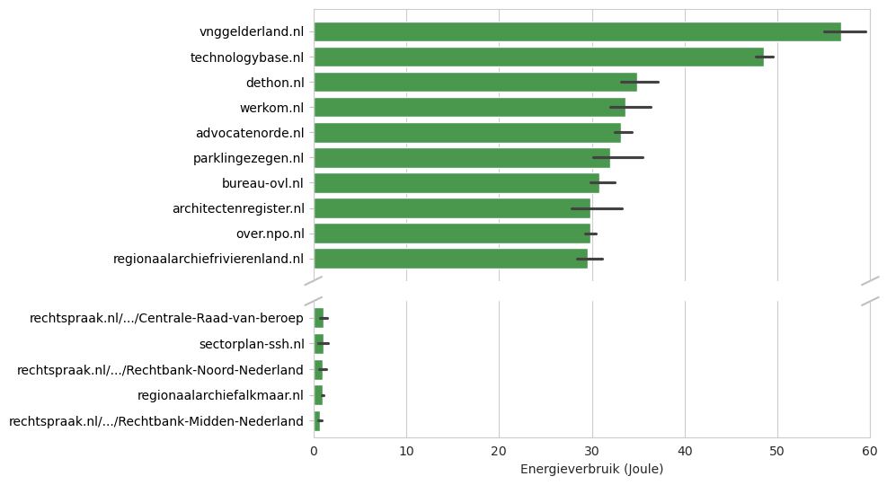
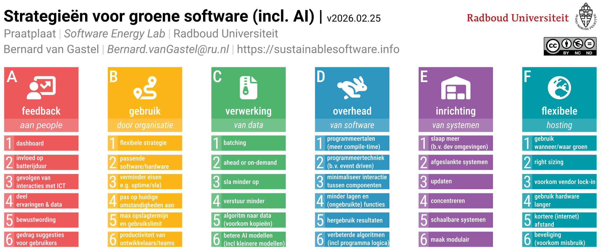

Steeds meer overheidsdiensten worden digitaal aangeboden.
Dat is prettig voor burgers en dienstverleners: informatie is snel toegankelijk en veel processen verlopen efficiënter.
Maar elke webpagina die wordt geladen verbruikt ook energie.
En terwijl de overheid samen met uitvoeringsorganisaties [werkt aan duurzamere IT‑voorzieningen](https://www.rijksictdashboard.nl/duurzaamheid), blijft de energie-impact van overheidswebsites nog buiten beeld.

Om hier beter inzicht in te krijgen hebben wij het volledige [Register van Overheidsorganisaties](https://organisaties.overheid.nl) doorzocht en het energieverbruik van 1150 Nederlandse overheidswebsites doorgemeten.
Daarmee brengen we in kaart welke websites zuinig zijn, welke onnodig veel energie gebruiken, en waar de grootste kansen liggen om het digitale energieverbruik te verminderen.

### Hoe we meten

Dit soort metingen voeren wij uit in ons [Software Energie Lab](https://gitlab.com/software-energy-lab) op de Radboud Universiteit.
In dit lab onderzoeken we onder gecontroleerde omstandigheden het energieverbruik van software&mdash;van websites tot algorithmes en AI‑toepassingen.
Dit doen we onder andere met gespecialiseerde meetapparatuur die precies vastlegt hoeveel energie een computer verbruikt, zoals bij het laden van een webpagina.
Hierdoor kunnen we websites betrouwbaar met elkaar vergelijken.

### Wat we vonden

De meeste overheidswebsites blijken relatief energiezuinig.
Dat is goed nieuws: veel sites zijn eenvoudig opgebouwd en bevatten weinig zware elementen zoals multimedia, scripts, of interactieve componenten.
Toch zien we ook forse uitschieters.
Zo'n honderd websites verbruiken 2 tot wel 10 keer zo veel energie als het gemiddelde.
Vergeleken met de zuinigste websites loopt dit verschil zelfs op tot bijna factor 100.
Er valt duidelijk nog veel te winnen.

  

Wanneer we de top‑10 van meest energie-intensieve websites bekijken, valt één ding direct op: bij het laden van deze pagina's start automatisch een video of animatie.
Dat ziet misschien aantrekkelijk uit, maar het vraagt veel rekenkracht van de laptop of telefoon van de bezoeker.
Dit leidt tot onnodig hoog energieverbruik, en zorgt er ook voor dat je batterij sneller leeg is.

  

Een opvallende uitschieter is het [Regionaal Archief Rivierenland](https://regionaalarchiefrivierenland.nl).
De website oogt eenvoudig en bevat op het eerste gezicht geen grote animaties of zware componenten, maar belandt toch in de top‑10.
Als we verder door de homepagina kijken zien we snel waarom: onderaan de pagina staan meerdere ingesloten YouTube-video's en Spotify-podcasts.
Dit betekent dat de pagina niet alleen merkbaar trager laadt, maar dat er ook voortdurend energie wordt verspild aan media-elementen die veel bezoekers waarschijnlijk niet eens zien of gebruiken.

  

### Energie besparen

Het hoge energieverbruik van deze websites is niet noodzakelijk.
In veel gevallen kunnen eenvoudige aanpassingen al grote winst opleveren, zoals:
* Animaties en video's niet automatisch laten afspelen.
* Media pas laden wanneer een gebruiker er actief op klikt.
* Overbodige scripts, plug-ins, en trackers verwijderen.
* Afbeeldingen optimaliseren en comprimeren.

We hebben dit getest door de zelfde metingen nog eens uit te voeren, nu zonder animaties en media.
Niet elke website wordt evenveel bezocht: grote diensten zoals de Belastingdienst of DUO trekken miljoenen bezoekers per jaar, maar kleine gemeenten en regionale organisaties slechts duizenden.
Voor een grove schatting hanteren we een gemiddelde van ongeveer 50.000 bezoeken per website per jaar.
Zelfs met deze voorzichtige schatting zien we dat eenvoudige optimalisaties gezamenlijk kunnen leiden tot een besparing die overeenkomt met het jaarlijkse elektriciteitsverbruik van TODO huishoudens.

### Een gezamelijke taal

Om organisaties te helpen deze verbeteringen niet alleen technisch maar ook organisatorisch door te voeren, hebben we een [praatplaat](https://sustainablesoftware.info/strategies.page) ontwikkeld met concrete strategieën voor duurzame software.
Deze praatplaat biedt een gemeenschappelijke taal die de communicatie tussen beleidsmakers, ontwikkelaars, ontwerpers, en leveranciers bevordert.
Door strategieën overzichtelijk te presenteren, wordt het eenvoudiger om interne gesprekken te voeren, prioriteiten te bepalen, en duurzame keuzes structureel onderdeel te maken van het ontwikkelproces.
Zo kunnen organisaties sneller en effectiever stappen zetten richting een energiezuinigere digitale overheid.

  

### Doe mee

Het verduurzamen van overheidswebsites vraagt geen grote investeringen, maar vooral aandacht en bewuste keuzes op basis van metingen.
Ben je zelf betrokken bij een overheidsorganisatie, of beheer je een website? Kijk dan eens kritisch naar de pagina's die je publiceert.
Laaghangend fruit en kleine aanpassingen kunnen al een merkbaar verschil maken in energieverbruik én gebruikservaring.

Wil je weten hoe jouw website scoort, of wil je samen onderzoeken waar optimalisaties mogelijk zijn?
Neem gerust contact met ons op via TODO.
