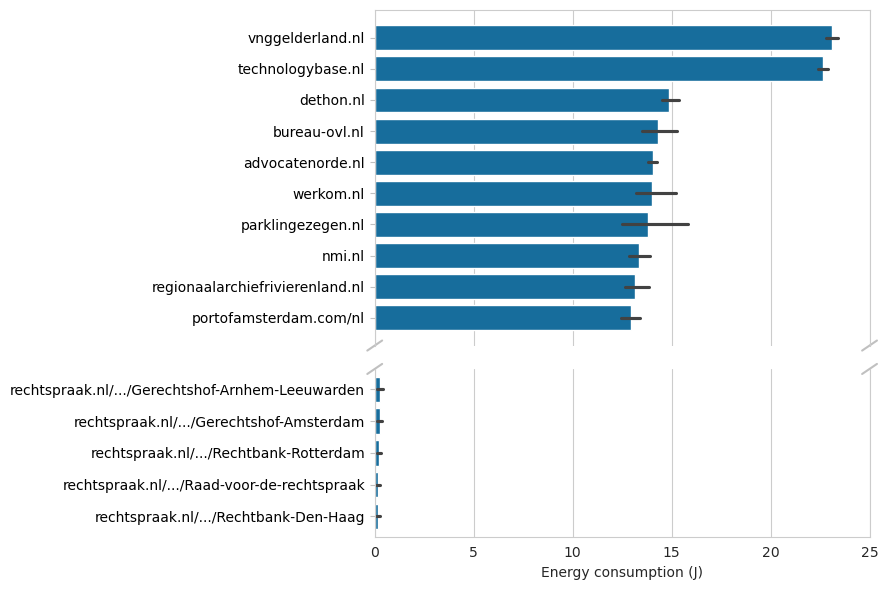
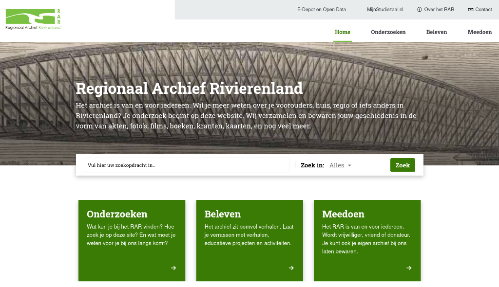

Steeds meer overheidsdiensten zijn digitaal.
Dat is handig voor burgers, maar elke website die bezocht word kost ook energie.
Alhoewel de overheid samen met dienstverlenende instanties werkt aan duurzamere IT, blijft de impact van overheidswebsites vaak buiten beeld.
Wij hebben het [Register van Overheidsorganisaties](https://organisaties.overheid.nl) doorzocht en het energieverbruik van alle 1150 overheidswebsites doorgemeten.
Hiermee brengen wij in kaart welke websites veel energie gebruiken, en waar winst te behalen is.

Deze metingen doen wij in ons _Software Energie Lab_ op de Radboud Universiteit.
[Korte uitleg over SEL...]

[leuke foto van de Odroid? Of misschien die foto van ons die hier op de uni hangt?]

De meeste websites gebruiken weinig energie, maar er zijn ook veel uitschieters.
Zo'n honderd websites gebruiken 2 tot wel 10 keer zo veel energie als het gemiddelde.

Kijkende naar de top-10 is meteen duidelijk waar winst te behalen is: deze websites tonen een video of animatie zodra je de website laadt.
Dat ziet er leuk uit, maar vraagt ook erg veel stroom van jouw computer of mobiel.
Tot wel 10 keer zo veel als de gemiddelde website!

In de top-10 zit ook een rare uitschieter: het [Regionaal Archief Rivierenland](https://regionaalarchiefrivierenland.nl).
De website lijkt simpel, maar toch belandt deze op plek 9 van alle 1150 websites!
Als we door de homepagina kijken is al snel duidelijk waarom: onderaan de pagina staan meerdere YouTube videos en Spotify podcasts.
Dit zorgt er niet alleen voor dat de pagina enkele seconden moet laden, maar verpilt ook veel energie aan iets wat de meeste mensen nieteens zullen zien.

Het hoge energieverbruik van deze grootverbruikers is niet nodig, en erg zonde.
Als deze websites hun energieverbruik verminderen, door animaties uit te zetten en onnodige features weg te halen, kan dit grote impact hebben.
[Berekenen hoe veel energie bespaard kan worden als de grootste energieslurpers hun websites verbeteren...]

[Overheid Duurzaamheid](https://www.rvo.nl/onderwerpen/energie-besparen/energie-efficiente-overheid)
[Logius Duurzaamheid](https://www.logius.nl/over-ons/duurzaamheid)
